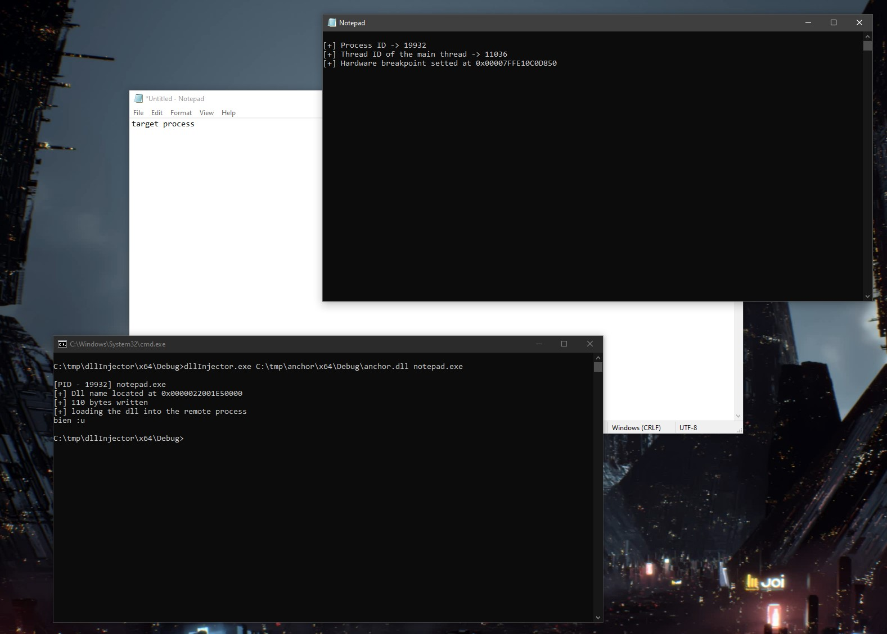
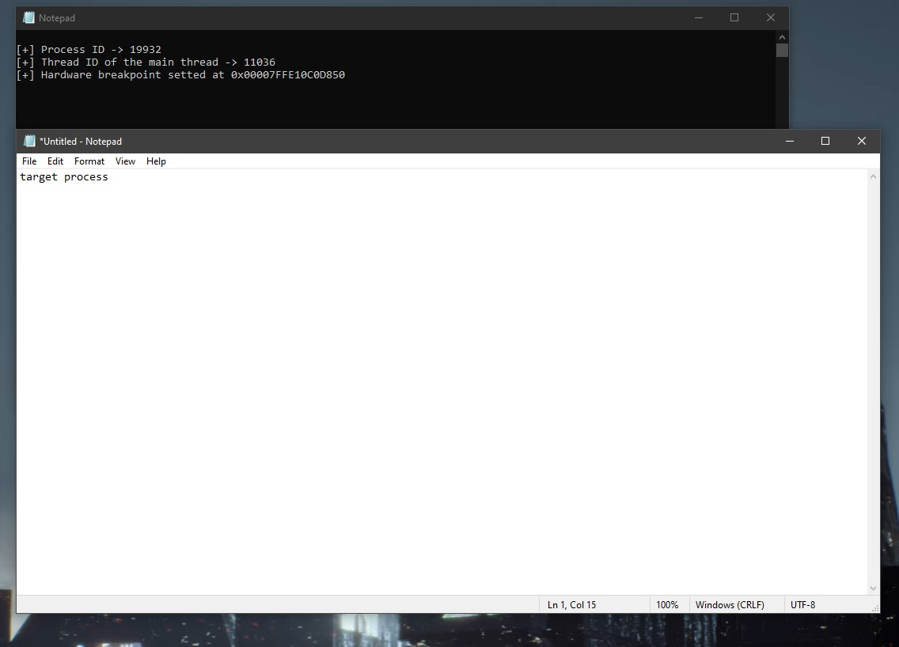
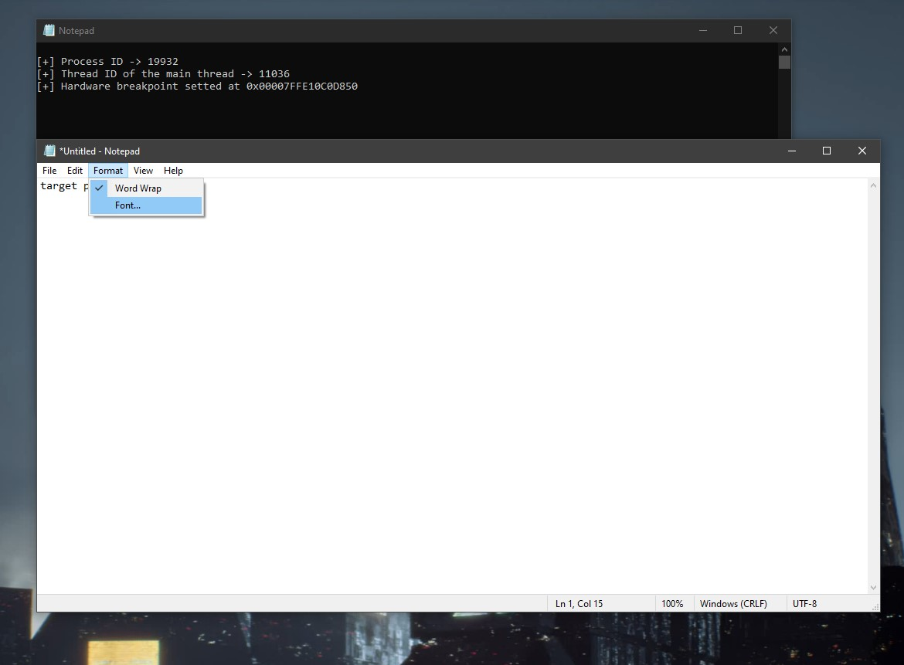
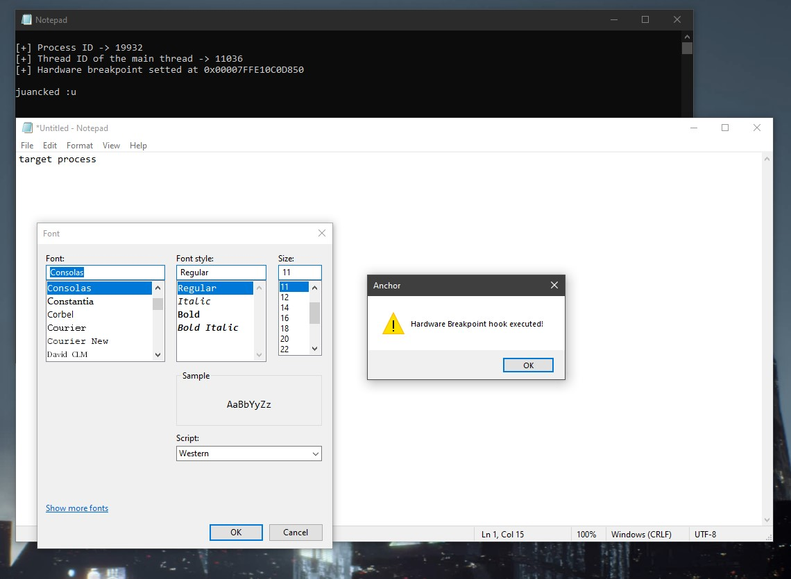

# Anchor

### About
Injectable DLL that sets hardware breakpoints on NT functions.

### Functionality
- Once injected, the DLL sets hardware breakpoints on NT functions.
- After any of the hooked functions are called, the execution flow is redirected to the "malicious code", which displays a MessageBox for the proof of concept (POC).
- After executing our code, the hardware breakpoints are cleaned up, and the process continues normally. (I chose to execute the custom code only once for the POC, but this can be modified.)

### Disclaimer
- The code lacks operational security (opsec) measures (e.g., no removal of CRT libraries, no indirect syscalls, no API hashing). This is because the primary goal was to explore hardware breakpoint hooking on a remote process.
- A DLL injector is included:
  - The code is not commented (as it is in Archor), as it is not the main focus of this repository.
  - It is a rudimentary injector, but again, this is not the main focus.

### Preview
Here is a preview of how it works:

1. First, choose the target process (in this case, "notepad.exe") and load the DLL into it. (You can use DllInjector or whatever injector you want)
  

2. Target process and the dll loaded.

3. Triggering the hardware breakpoint...

4. Done! The code has been executed, and the process continues running normally.

### Credits
- [Blindside: A New Technique for EDR Evasion with Hardware Breakpoints](https://cymulate.com/blog/blindside-a-new-technique-for-edr-evasion-with-hardware-breakpoints)
- [StealthHook - A method for hooking a function without modifying memory protection](https://www.x86matthew.com/view_post?id=stealth_hook)
- [Function Hooking: Hardware Breakpoints](https://www.codereversing.com/archives/594)
- [hwbp4mw by @rad9800](https://github.com/rad9800/hwbp4mw/)

